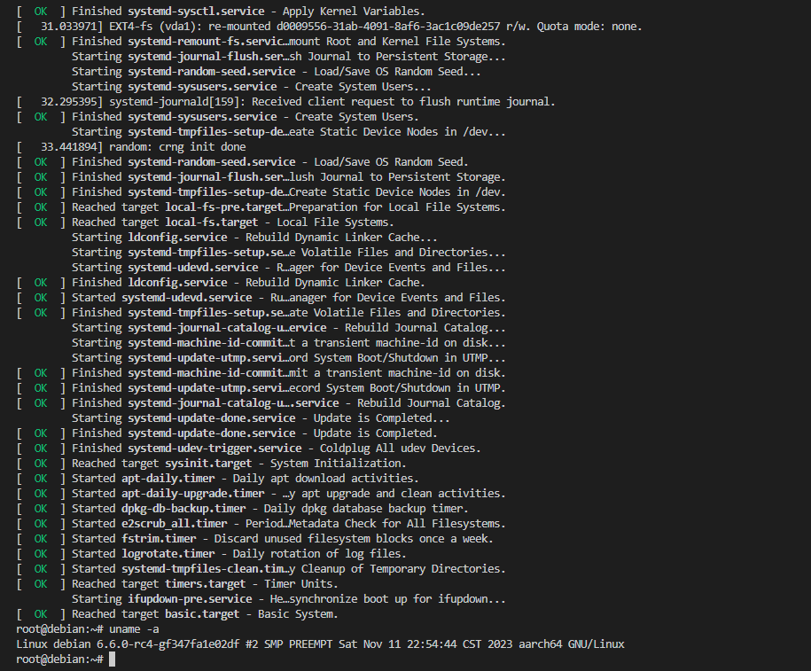

## Setup

1. Get source code 
```
git clone https://github.com/Rust-for-Linux/linux -b rust-dev
```

2. Install dependencies

Ubuntu 22.04
```
sudo apt-get -y install \
  binutils build-essential libtool texinfo \
  gzip zip unzip patchutils curl git \
  make cmake ninja-build automake bison flex gperf \
  grep sed gawk bc \
  zlib1g-dev libexpat1-dev libmpc-dev \
  libglib2.0-dev libfdt-dev libpixman-1-dev libelf-dev libssl-dev

sudo apt-get install clang-format clang-tidy clang-tools clang clangd libc++-dev libc++1 libc++abi-dev libc++abi1 libclang-dev libclang1 liblldb-dev libllvm-ocaml-dev libomp-dev libomp5 lld lldb llvm-dev llvm-runtime llvm python3-clang

sudo apt install clang llvm
```

```
cd linux
make LLVM=1 rustavailable
rustup override set $(scripts/min-tool-version.sh rustc)
rustup component add rust-src
cargo install --locked --version $(scripts/min-tool-version.sh bindgen) bindgen-cli
```
 
3. Build
```
make ARCH=arm64 LLVM=1 O=build defconfig

make ARCH=arm64 LLVM=1 O=build menuconfig
#set the following config to yes
General setup
        ---> [*] Rust support

make ARCH=arm64 LLVM=1 -j$(nproc)
```

## Run

1. Build qemu
```
# https://people.debian.org/~gio/dqib/
wget https://download.qemu.org/qemu-7.0.0.tar.xz 
tar xvJf qemu-7.0.0.tar.xz
cd qemu-7.0.0
# add riscv, arm64 support
./configure --target-list=riscv64-softmmu,riscv64-linux-user,aarch64-softmmu
make -j$(nproc)
```
2. Debian image
```
cd linux/build
wget -O dqib_arm64-virt.zip https://gitlab.com/api/v4/projects/giomasce%2Fdqib/jobs/artifacts/master/download?job=convert_arm64-virt
unzip dqib_arm64-virt.zip
cd dqib_arm64-virt
# replace kernel to previous built one, mind your work dir
qemu-system-aarch64 -machine 'virt' -cpu 'cortex-a57' -m 1G -device virtio-blk-device,drive=hd -drive file=image.qcow2,if=none,id=hd -device virtio-net-device,netdev=net -netdev user,id=net,hostfwd=tcp::2222-:22 -kernel ../arch/arm64/boot/Image -initrd initrd -nographic -append "root=LABEL=rootfs console=ttyAMA0"
```
3. Result

