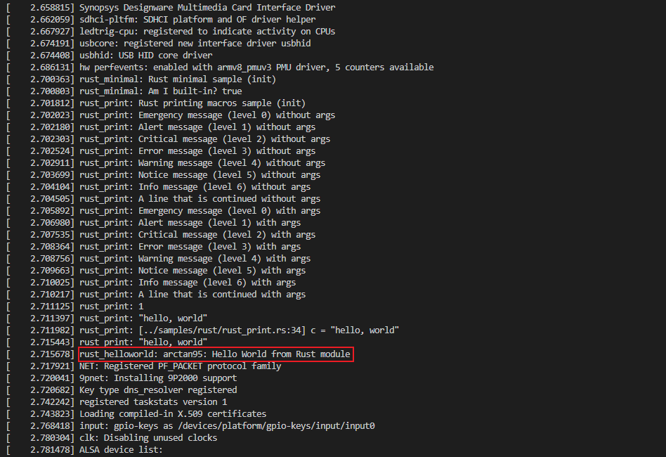

## Extra modification
In the latest rust-dev branch, sample code should be
```
// SPDX-License-Identifier: GPL-2.0
//! Rust helloworld sample.

use kernel::prelude::*;

module! {
  type: RustHelloWorld,
  name: "rust_helloworld",
  author: "whocare",
  description: "hello world module in rust",
  license: "GPL",
}

struct RustHelloWorld {}

impl kernel::Module for RustHelloWorld {
    # function changed here: removed _name: &'static CStr 
    fn init(_module: &'static ThisModule) -> Result<Self> {
        pr_info!("arctan95: Hello World from Rust module");
        Ok(RustHelloWorld {})
    }
}

```

## Result

